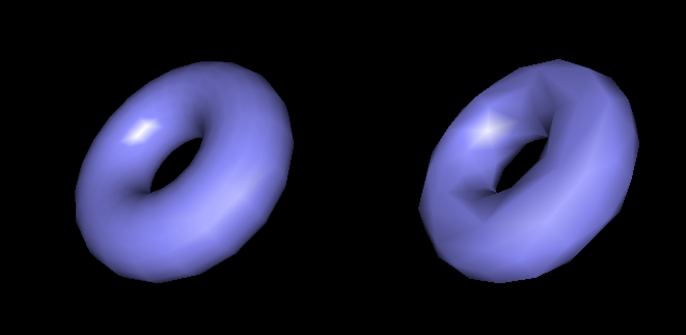
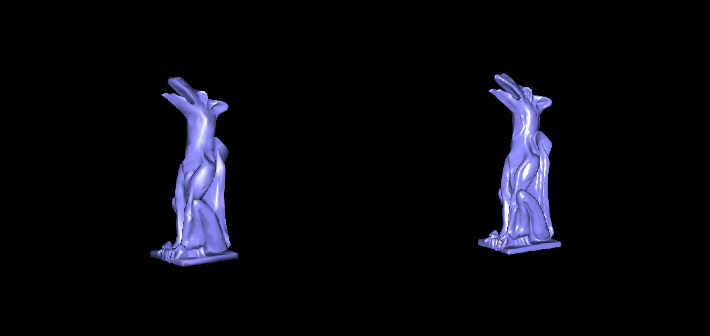
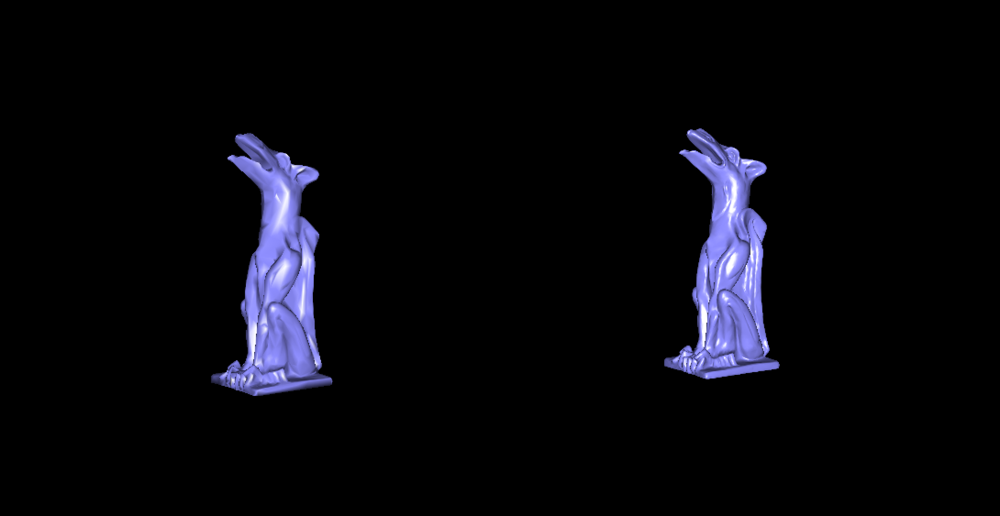

Ye Kuang \<yekuang@mit.edu\>

- To compile and run on a Linux machine, simply use:
  
  ```
  make
  ```

  Tested on Athena, Ubuntu 14.04. Some subtle change of the makefile and included header will also make the code compile and run on Mac.

- No, I finished HW0 on my own.

- I found the paper Garland 97 very interesting and implemented a simplified version of it.

- As far as I know, no.

- Yes, I implemented a mouse-based camera control to rotate, with the lighting position being auto-corrected to follow the camera's movement. Also, the mesh contraction is supported, try press 'm' to see the effect. The algorithm is not very efficient, though, and it only works very well on small objects like 'sphere.obj' and 'torus.obj'. For 'garg.obj', while the number of vertices have been reduced to about 2,000, this would really take a long time. The reason lies in the fact that each time a pair of vertices is contracted, we have to recompute the entire heap again.

The essential work lied in implementing a class that can hold and query any connection relationship between vertices and their adjacent triangle faces efficiently. Other than that it was just following the algorithm flow described in the paper. Bugs existed in:
  
  - Wrong matrix used in calculating \bar v. Originally I thought it was just the reverse of \bar Q, then I noticed it was something different.
  - After I made those triangles previously connected to v_2 update their vertex data to contain v_1, I forgot to also add these faces into v_1's vertex data (as its updated adjacent faces).
  - We are programmers! It's not a very reasonable design in '.obj' to use index that starts from 1, instead of 0, for faces data! So many hours were spent before I realized that the indices were wrong.


Contraction on 'torus.obj'



Contraction on 'garg.obj'